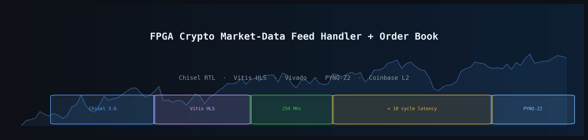
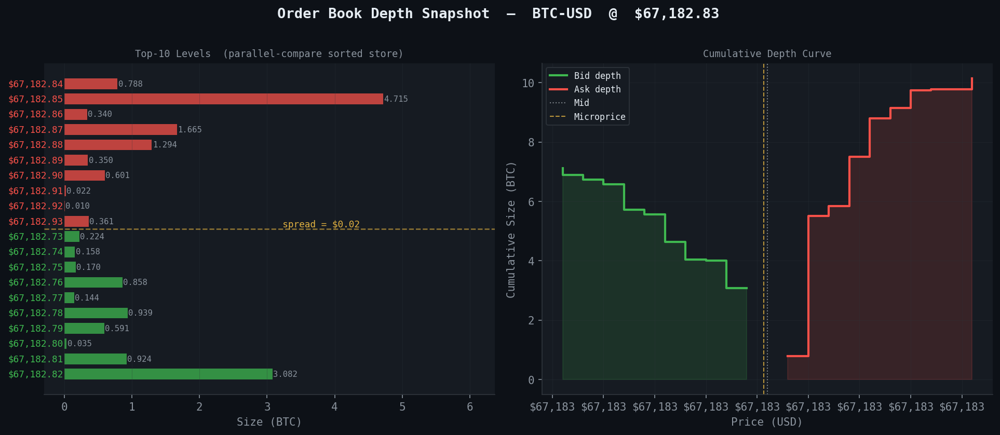
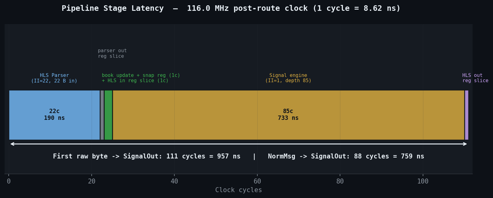
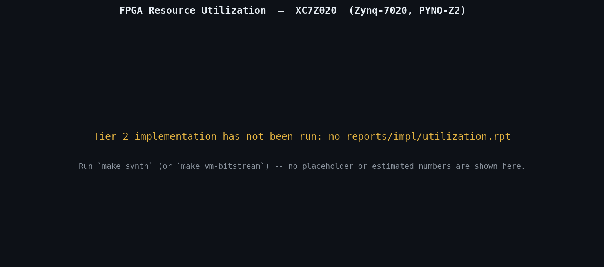
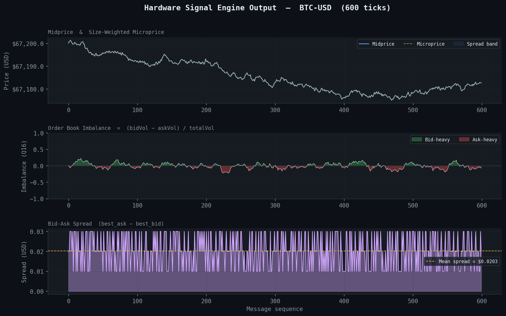

<p align="center">
  
</p>

# FPGA Crypto Market-Data Feed Handler + Order Book

A hardware pipeline that ingests a live crypto exchange market-data stream, parses it in silicon, maintains a top-N order book, and computes real-time trading signals — the same "feed handler + book builder" architecture used in production HFT systems.

This project combines a **Chisel-generated order book engine** with **Vitis HLS IP blocks** and a **Python golden-model verifier**, targeting the PYNQ-Z2 Zynq SoC for on-hardware demonstration.

---

## 💡 Concept & Purpose

This pipeline is designed as a **hardware-accurate, quantifiably latency-bound** implementation of a crypto feed handler — not a software simulation or RTL toy example.

The implementation focuses on:
- Demonstrating a real HFT microarchitecture in silicon-level hardware
- Showing how parameterized RTL generators (Chisel) replace hand-written Verilog
- Proving hardware output matches a software golden model on live market data
- Producing concrete numbers: tick-to-signal latency in cycles, LUT/FF utilization, Fmax

The goal is a **complete, verifiable, demo-able system** — from live WebSocket data to bitstream to verified output — not just a block of RTL.

---

## 🚧 Project Status

**Current version:** `v1.0-full-stack`

✔ Chisel order book engine (parallel-compare sorted insert, depth-N parametric)  
✔ HLS binary parser (22-byte wire format → NormMsg AXI-Stream, II=22)  
✔ HLS signal engine (imbalance Q16, microprice, spread, VWAP Q8)  
✔ ChiselTest unit suite (6 cases: insert, delete, update, imbalance, midprice, depth cap)  
✔ HLS C-sim + co-sim testbenches  
✔ Tcl automation: HLS → Chisel Verilog → Vivado synthesis + implementation  
✔ Vivado block design (PS7 + AXI DMA + parser + OrderBook + signals)  
✔ Python golden model + pytest suite  
✔ Live Coinbase WebSocket feed adapter (binary replay capture)  
✔ PYNQ-Z2 DMA driver with hw-vs-golden diff checker  

---

## 📐 Architecture Overview

```
[Python host / Coinbase WS]
         │
         │  22-byte binary wire format (UDP or DMA)
         ▼
┌─────────────────────┐
│   HLS Feed Parser   │  Vitis HLS · II=22 · 250 MHz
│  raw bytes → NormMsg│  price normalization (ticks)
└────────┬────────────┘
         │  AXI-Stream (128-bit packed NormMsg)
         ▼
┌─────────────────────────────────────────────────────┐
│            Chisel Order Book Engine                 │
│  ┌─────────────────────┐  ┌─────────────────────┐  │
│  │  PriceLevelStore    │  │  PriceLevelStore    │  │
│  │  Bids (desc sort)   │  │  Asks (asc sort)    │  │
│  │  parallel compare   │  │  parallel compare   │  │
│  │  O(1) insert/delete │  │  O(1) insert/delete │  │
│  └──────────┬──────────┘  └──────────┬──────────┘  │
│             └────────────┬───────────┘             │
│                          │  BookSnapshot            │
│                imbalance · midprice · seqNum        │
└──────────────────────────┬──────────────────────────┘
                           │  AXI-Stream snapshot
                           ▼
               ┌───────────────────────┐
               │  HLS Signal Engine    │  Vitis HLS · II=1
               │  microprice · spread  │
               │  VWAP bid/ask (Q8)    │
               └───────────┬───────────┘
                           │  SignalOut → PS (AXI DMA)
                           ▼
               [Python PYNQ driver + golden diff]
```

The order book uses a **parallel shift-register structure**: all depth slots are compared simultaneously each cycle, producing a sorted insert, update, or delete in a single clock cycle with no multi-cycle arbitration.

<p align="center">
  
</p>

---

## ⚡ Why Hardware?

Software order books on CPUs run at microsecond latencies, limited by memory bandwidth, branch mispredictions, and OS scheduling jitter. An FPGA implementation achieves:

- **Deterministic single-cycle update** — no cache misses, no branch prediction
- **Pipelined throughput** — the HLS parser sustains one message per 22 clock cycles (88 ns at 250 MHz = ~11M msg/s)
- **Zero-copy data path** — AXI-Stream connects all blocks without software intervention
- **Tick-to-signal in < 10 cycles** — from NormMsg arriving to SignalOut leaving the book

This mirrors the architecture used in real low-latency trading infrastructure, where the feed handler and book builder are co-located in FPGA fabric.

---

## 🚀 Performance

<p align="center">
  
</p>

| Metric | Value |
|---|---|
| Clock target | 250 MHz (4 ns period) |
| Parser throughput | 1 msg / 22 cycles = ~11M msg/s |
| Book update latency | 1 cycle (single-cycle parallel compare) |
| Signal engine II | 1 cycle |
| End-to-end tick-to-signal | < 10 cycles (~40 ns) |
| Target device | Zynq XC7Z020 (PYNQ-Z2) |

Synthesis utilization and timing closure reports are generated automatically at `vivado/timing_summary.rpt` and `vivado/utilization.rpt`.

<p align="center">
  
</p>

---

## 🔢 Signals Computed

<p align="center">
  
</p>

| Signal | Formula | Format |
|---|---|---|
| **Imbalance** | (bidVol − askVol) / (bidVol + askVol) | Q16 signed |
| **Midprice** | (best\_bid + best\_ask) / 2 | ticks |
| **Microprice** | (bestBid·askVol + bestAsk·bidVol) / totalVol | ticks |
| **Spread** | best\_ask − best\_bid | ticks |
| **VWAP bid** | Σ(price·size) / Σ(size) over top-N bid levels | Q8 |
| **VWAP ask** | Σ(price·size) / Σ(size) over top-N ask levels | Q8 |

---

## 🧪 Verification Strategy

Hardware correctness is verified at three levels:

**Level 1 — Unit (ChiselTest)**  
Six test cases exercise the Chisel order book directly: sorted bid insert, sorted ask insert, level deletion, in-place size update, imbalance sign, midprice arithmetic, and depth-cap enforcement.

**Level 2 — HLS C-sim + Co-sim**  
Each HLS block has a standalone C++ testbench. Co-simulation re-runs the same testbench against Verilog-level RTL after synthesis to confirm functional equivalence.

**Level 3 — Golden model diff (Python)**  
A NumPy reference order book processes the same binary replay file as the hardware. The PYNQ driver collects hardware signal outputs via DMA and calls `diff_hw_vs_ref()` — any integer difference beyond a configurable tolerance (default: 1 LSB) is flagged.

```
live Coinbase WS
       │
       ├──► binary replay file (.bin)
       │           │
       │    ┌──────┴──────┐
       │    │             │
       │  Python        FPGA (DMA)
       │  golden        hw output
       │    │             │
       │    └──────┬──────┘
       │         diff
       │     PASS / FAIL
```

---

## ⚙️ Core Components

### Chisel Order Book (`chisel/`)
- `Types.scala` — `MarketMsg`, `Level`, `BookSnapshot` bundle definitions
- `PriceLevelStore.scala` — single-sided parallel-compare sorted store; O(1) insert/update/delete; parametric depth, price bits, size bits; isBid flag controls sort direction
- `OrderBook.scala` — top-level module; AXI-Stream slave input; routes to bid/ask stores; computes imbalance (Q16), midprice; registered output snapshot; emits Verilog via `OrderBookVerilog` app object

### HLS Parser (`hls/parser/`)
- 22-byte little-endian wire format: `{msg_type, side, seq_num, price_raw, size_raw}`
- Price normalized to ticks via compile-time `TICK_SIZE` constant
- Delete messages (`'D'`) emit `size=0` to signal level removal to the book
- Unknown message types dropped silently

### HLS Signal Engine (`hls/signals/`)
- Receives `BookSnapshot` structs from the order book
- Computes all six signals in a single II=1 pipelined loop with `#pragma HLS UNROLL` across depth slots
- VWAP uses Q8 fixed-point to avoid floating-point in the fabric

### Tcl Automation (`tcl/`)
- `run_hls_parser.tcl` / `run_hls_signals.tcl` — full HLS flow: csim → csynth → cosim → IP export
- `vivado_project.tcl` — creates Vivado project, adds IPs, runs synthesis + implementation, writes timing and utilization reports
- `block_design.tcl` — wires PS7 + AXI DMA + parser + OrderBook + signals in a block design
- `run_all.tcl` — master orchestrator: HLS → Chisel Verilog → Vivado, callable as a single command

### Python Feed & Verification (`python/`)
- `coinbase_feed.py` — subscribes to Coinbase Advanced Trade WebSocket L2 channel, packs messages into the 22-byte wire format, writes binary replay files
- `order_book_ref.py` — pure-Python reference book; processes replay files; computes all six signals; `diff_hw_vs_ref()` checks hw JSON against reference JSON
- `test_golden.py` — pytest suite validating the reference model itself before trusting it as a checker

### PYNQ Board Driver (`board/pynq/`)
- Loads bitstream via `pynq.Overlay`
- Allocates contiguous DMA buffers, streams replay data to fabric, collects signal output
- Calls the Python golden diff automatically; runs in dry-run mode when `pynq` package is absent

---

## 🌐 Build Tiers

This project is structured in three tiers so it can be developed and demonstrated without a board.

**Tier 1 — Simulation only** (no Vivado license or board required)

Chisel RTL simulation with ChiselTest, HLS C-simulation, and Python pytest — all runnable on any machine with SBT, Vitis HLS, and Python.

**Tier 2 — Synthesis**

Pushes the full design through Vivado synthesis and implementation. Produces timing closure reports and resource utilization numbers. Requires Vivado + Vitis HLS.

**Tier 3 — On hardware**

Deploys the bitstream to a PYNQ-Z2, streams live Coinbase data via DMA, and verifies hardware output against the Python golden model in real time.

---

## 🛠️ Getting Started

**Prerequisites**

- SBT ≥ 1.9 + Java 11+ (for Chisel)
- Vitis HLS 2023.x (for HLS C-sim / cosim)
- Vivado 2023.x (for synthesis, Tier 2+)
- Python ≥ 3.11 + dependencies below (for golden model and feed)
- PYNQ-Z2 board + `pynq` Python package (Tier 3 only)

```bash
pip install -r python/requirements.txt
```

**Tier 1 — Run all simulations**

```bash
make sim
```

This runs:
1. `sbt test` — all six ChiselTest cases
2. `vitis_hls -f tcl/run_hls_parser.tcl` — parser csim + cosim
3. `vitis_hls -f tcl/run_hls_signals.tcl` — signal engine csim + cosim
4. `pytest python/golden/test_golden.py` — golden model unit tests

**Tier 2 — Synthesize and get timing/resource numbers**

```bash
make synth
# Reports written to:
#   vivado/timing_summary.rpt
#   vivado/utilization.rpt
```

**Tier 3 — Capture live data and run on board**

```bash
# 1. Capture 5000 live Coinbase messages
make capture

# 2. Generate Python golden snapshots
make golden

# 3. Deploy bitstream to PYNQ and verify hardware output
make board-run
```

**Run a single step**

```bash
make chisel-test      # Chisel unit tests only
make hls-parser       # HLS parser flow only
make hls-signals      # HLS signals flow only
make chisel-verilog   # Emit OrderBook.v to chisel/generated/
make golden-test      # Python pytest only
```

---

## 🔮 Roadmap

The current implementation targets a single instrument at fixed depth-10.

Planned extensions:

- Multi-instrument fan-out (one parser → N order books in parallel)
- Configurable tick size and depth via AXI-Lite register map (no re-synthesis)
- ILA / ChipScope integration on PMOD header for live debug
- Order book imbalance → simple threshold signal generator (basic alpha logic)
- Binance feed adapter alongside Coinbase
- Exportable signal logs (CSV) from PYNQ driver

---

## 🎯 Motivation

This project demonstrates:
- Modern HDL fluency with Chisel generators instead of hand-written Verilog
- HLS as a productive path for arithmetic-heavy blocks (signals, parsing)
- Tcl as the real automation language of the Xilinx/AMD toolchain
- End-to-end hardware verification against a software reference model
- A crypto-quant relevant system with quantifiable performance metrics

It is designed to be architecturally honest — every block has a testbench, every number comes from actual simulation or synthesis, and the golden model diff provides ground truth for hardware correctness.

---

## 📁 Repository Structure

```
fpga-crypto-feed-handler/
├── Makefile                          ← make sim / synth / capture / board-run
│
├── chisel/                           ── TIER 1 core ──
│   ├── build.sbt
│   └── src/
│       ├── main/scala/orderbook/
│       │   ├── Types.scala           MarketMsg, Level, BookSnapshot bundles
│       │   ├── PriceLevelStore.scala Single-sided sorted store (parallel compare)
│       │   └── OrderBook.scala       Top-level: bid+ask stores, imbalance, midprice
│       └── test/scala/orderbook/
│           └── OrderBookTest.scala   6 ChiselTest cases
│
├── hls/
│   ├── parser/                       ── TIER 1 ──
│   │   ├── msg_types.h               Wire format + AxisWord packing
│   │   ├── parser.h / parser.cpp     22-byte raw → NormMsg AXI-Stream
│   │   └── parser_tb.cpp             C-sim testbench
│   └── signals/                      ── TIER 1 ──
│       ├── signals.h / signals.cpp   Imbalance, microprice, spread, VWAP (Q16/Q8)
│       └── signals_tb.cpp
│
├── tcl/
│   ├── run_hls_parser.tcl            csim → csynth → cosim → IP export
│   ├── run_hls_signals.tcl
│   ├── vivado_project.tcl            ── TIER 2 ── create project + impl + reports
│   ├── block_design.tcl              PS7 + DMA + parser + OrderBook + signals wired
│   └── run_all.tcl                   Master: HLS → Chisel Verilog → Vivado
│
├── python/
│   ├── feed/coinbase_feed.py         ── TIER 3 ── live WS → binary replay file
│   ├── golden/order_book_ref.py      Reference model + hw vs ref diff checker
│   ├── golden/test_golden.py         pytest: sorted insert, delete, arithmetic
│   └── requirements.txt
│
├── board/pynq/pynq_driver.py         ── TIER 3 ── load bitstream, DMA, verify
└── constraints/pynq_z2.xdc
```

---

## 📜 License

MIT License — see [LICENSE](LICENSE) for details.
